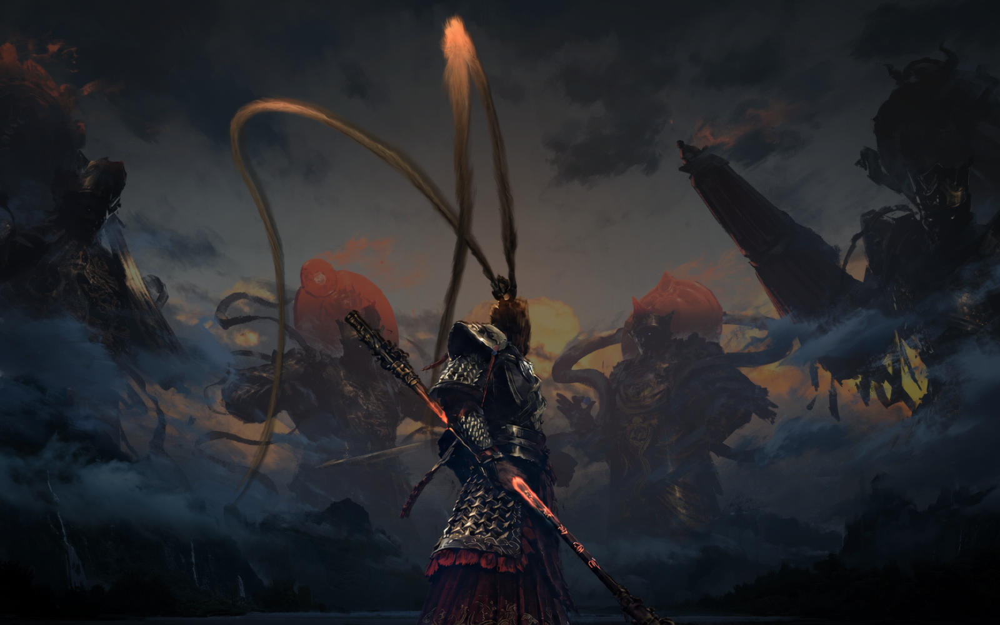

# Wukong Cinema

Windows 10/11용 개인 대기 화면입니다. 5분 동안 입력이 없거나 `Ctrl + Alt + G`를 누르면 원본 배경이 어두워지고, 손오공이 강조되며 화면 전체가 부드럽게 확대됩니다. 키보드나 마우스/터치패드를 건드리면 바탕화면으로 돌아갑니다. 원래 배경화면과 바탕화면 아이콘은 변경하지 않습니다.

## 설치와 사용

1. GitHub의 **Code → Download ZIP**으로 받은 파일을 한 폴더에 압축 해제합니다. 아래 JPG, PNG와 EXE가 같은 폴더에 있어야 합니다.
2. `Start-WukongIdleScreen.cmd`를 실행하면 백그라운드에서 시작합니다.
3. 로그인할 때와 잠금 해제할 때 자동 실행하려면 `Install-Autostart.cmd`를 한 번 실행합니다. 현재 계정의 작업 스케줄러에만 등록되며 관리자 권한은 필요하지 않습니다.

`Ctrl + Alt + G`는 즉시 미리보기, `Ctrl + Alt + Shift + G` 또는 `Stop-WukongIdleScreen.cmd`는 현재 실행 종료입니다. 자동 시작까지 제거하려면 `Remove-Autostart.cmd`를 실행하세요. 화면이 자동으로 뜨는 시간은 기본 5분입니다.

Windows의 **화면 끄기/절전** 시간은 별도 설정입니다. 대기 화면을 계속 보려면 그 시간을 5분보다 길게 하거나 끄세요.

## 화면 비율

손오공 PNG와 원본 JPG를 한 좌표계에서 함께 확대하므로 서로 어긋나지 않습니다. 16:9·16:10·3:2·세로 화면은 중앙 인물을 우선해 꽉 차게 표시합니다. 울트라와이드는 그림 전체를 보존하고 양옆을 흐린 배경으로 자연스럽게 확장합니다. 여러 모니터도 각각의 화면 크기로 렌더링합니다.

## 파일과 빌드

- `WukongCinema.exe`: 바로 실행 가능한 프로그램
- `original-wallpaper.jpg`, `wukong-original-upscaled.png`: 실행에 필요한 이미지
- `Cinema.cs`: WPF 소스
- `Build.ps1`: Windows PowerShell 5.1과 .NET Framework로 EXE를 다시 빌드
- `Cinema.ps1 -RenderCheck`: 다양한 화면 비율의 미리보기 생성

소스를 수정해 다시 빌드하려면 PowerShell에서 `powershell.exe -NoProfile -ExecutionPolicy Bypass -File .\Build.ps1`을 실행하세요. 실행 중인 프로그램은 먼저 종료해야 EXE를 교체할 수 있습니다. 사용자가 제공한 이미지 파일은 코드를 수정하지 않는 한 이름을 바꾸지 마세요.

이 앱은 로컬에서만 작동하며 네트워크 연결이나 계정을 요구하지 않습니다. 이미지의 사용·재배포 권한은 코드 라이선스와 별도로 확인하세요.
